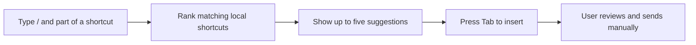

# Zalo Shortcuts

A local desktop message-expansion tool built with .NET 8, Avalonia and
SharpHook. It was designed for Zalo Desktop, but it can insert a saved message
into any focused text box on Windows or macOS.

This is an independent project. It is not affiliated with, endorsed by or
sponsored by Zalo or VNG Corporation.



## What it demonstrates

- Cross-platform desktop UI with Avalonia
- Windows and macOS global keyboard integration
- Native startup registration and macOS Accessibility permission handling
- Predictable prefix matching with exact-match priority
- Local JSON persistence with validation, duplicate protection and recovery
- System-tray operation and first-run onboarding
- Dependency-free automated tests for the core behaviour

## How it works

1. Save a message under a short keyword such as `/hello`.
2. Type `/` followed by all or part of that keyword in a text box.
3. Review the matching suggestions and press Tab.
4. The app replaces the typed shortcut with the saved message.
5. Press Enter yourself when you are ready to send.

The application never sends a message automatically.

## Privacy design

There is no account, subscription, analytics service or application network
client. Messages are stored locally in `shortcuts.json` under the operating
system's normal application-data directory:

- Windows: `%APPDATA%\ZaloShortcuts`
- macOS: `~/Library/Application Support/ZaloShortcuts`

The global keyboard listener begins buffering only after `/`, keeps at most a
41-character shortcut token in memory and clears it when the token no longer
matches. Typed keys are not written to disk or transmitted by the application.

Because global input hooks are security-sensitive, review
[`Services/ShortcutEngine.cs`](Services/ShortcutEngine.cs) before running the
application.

## Development

Requirements: the .NET 10 SDK (the application targets the .NET 8 runtime) and
the platform permissions required for global keyboard input.

```sh
dotnet restore tests/ZaloShortcuts.Tests/ZaloShortcuts.Tests.csproj --locked-mode
dotnet build ZaloShortcuts.csproj --configuration Release --no-restore
dotnet run --project tests/ZaloShortcuts.Tests/ZaloShortcuts.Tests.csproj \
  --configuration Release --no-restore
```

The current harness checks prefix ordering, exact-match priority, validation,
duplicate prevention, Unicode persistence and onboarding preferences.

## Platform notes

- Windows uses a per-user Startup Apps registration and does not require
  administrator access.
- macOS requires Accessibility permission for the global keyboard listener.
- Linux/X11 support exists for development, but the packaged application is
  aimed at Windows and macOS. Wayland blocks the required global hook.

## Distribution status

This repository contains source code for review. It does not include generated
build output, local user data, signing credentials or unsigned release
binaries. Public distribution would require Windows code signing and Apple
Developer ID signing and notarisation.

## Copyright

Copyright © 2026 John Helyar. All rights reserved. This repository is not
open source and no general licence is granted. See [`NOTICE.md`](NOTICE.md).

Third-party notices are provided in
[`THIRD-PARTY-NOTICES.txt`](THIRD-PARTY-NOTICES.txt) and [`Licenses/`](Licenses/).
